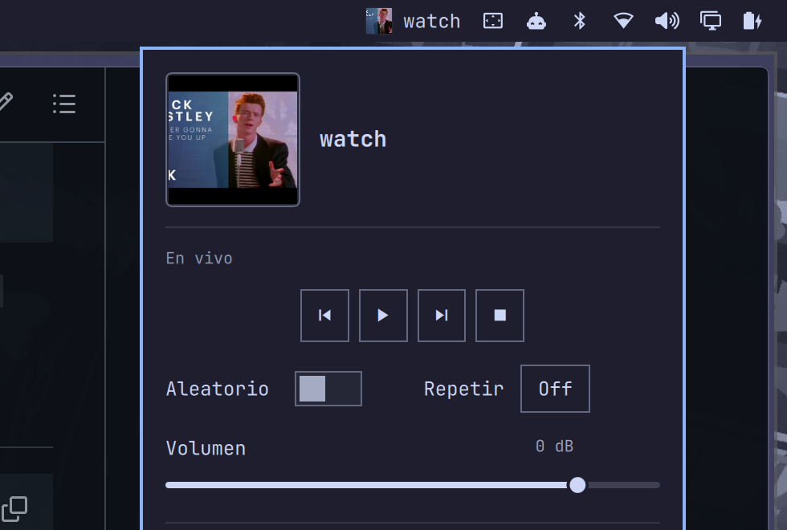

# cliamp — Omarchy bar plugin

Now-playing and playback controls for the [cliamp](https://github.com/bjarneo/cliamp)
terminal music player, in the Omarchy (Quattro / omarchy-shell) bar. A compact
bar item with a popup panel, plus a one-line toggle for infinite radio when the
[`yt-radio`](https://github.com/Cache21/cliamp-plugin-yt-radio) cliamp plugin is
loaded, and IPC methods for Hyprland keybinds.



## Features

- **Bar item** — cover thumbnail (or transport glyph) + scrolling `Artist — Title`.
  It reads `cliamp status --json` on an interval; no `playerctl`, no extra daemons.
  - left click — play / pause (`cliamp toggle`)
  - middle click — next track
  - right click — open / close the panel
  - scroll — volume ±1 dB
- **Panel** — 84px cover art, seekable progress bar (or "En vivo" for streams),
  prev / play-pause / next / stop, shuffle and repeat, a volume slider, and the
  yt-radio toggle.
- **Cover art** — for YouTube / YouTube Music tracks the video id in `track.path`
  becomes an `i.ytimg.com` thumbnail; local files use cliamp's embedded
  `album_art_url`; radio streams fall back to a glyph.
- **yt-radio** — a switch bound to `cliamp plugins call yt-radio status|toggle`.
  Disabled while cliamp is not running, because cliamp only loads Lua plugins in
  the TUI (not in `cliamp --daemon`).
- **IPC** — control cliamp from Hyprland or scripts via
  `omarchy-shell io.github.cache21.cliamp <method>`.

## Requirements

- Omarchy 4 (Quattro) with the omarchy-shell plugin system.
- `cliamp` ≥ 1.63 on `PATH` (Arch package `cliamp`).
- Optional: the `yt-radio` cliamp plugin for the infinite-radio toggle.
- JetBrainsMono Nerd Font (ships with Omarchy) for the transport glyphs.

## Install

```bash
omarchy plugin add https://github.com/Cache21/omarchy-cliamp --enable
omarchy bar move io.github.cache21.cliamp --section right --before omarchy.tray
```

The plugin is cloned to `~/.config/omarchy/plugins/io.github.cache21.cliamp/`
and lands disabled so you can review the code first; `--enable` turns it on.

## Settings

Set from the Omarchy menu → Setup → Bar, or in `~/.config/omarchy/shell.json`.

| Key | Type | Default | Description |
|---|---|---|---|
| `refreshIntervalSec` | integer | `2` | How often to poll `cliamp status --json`. |
| `maxLabelWidth` | integer | `220` | Label width (px) before the text scrolls. |
| `showArtist` | boolean | `true` | Show `Artist — Title` instead of just the title. |
| `hideWhenStopped` | boolean | `false` | Remove the widget from the bar while cliamp is not running. |
| `showYtRadioDot` | boolean | `true` | Accent dot next to the icon while yt-radio is active. |
| `showBarThumbnail` | boolean | `true` | Show the cover thumbnail in the bar instead of the glyph (falls back to the glyph when there's no art). |

Two extra keys are read from `shell.json` but not shown in the settings form
(rarely needed): `cliampPath` (default `cliamp`) and `ytRadioPlugin` (default
`yt-radio`).

## Hyprland keybindings

The plugin cannot edit your Hyprland config; add binds yourself, e.g. in
`~/.config/hypr/bindings.conf`:

```
bindd = SUPER, P,        cliamp play/pause,   exec, omarchy-shell io.github.cache21.cliamp playPause
bindd = SUPER, bracketright, cliamp next,     exec, omarchy-shell io.github.cache21.cliamp next
bindd = SUPER, bracketleft,  cliamp previous, exec, omarchy-shell io.github.cache21.cliamp previous
bindd = SUPER SHIFT, R,  cliamp yt-radio,     exec, omarchy-shell io.github.cache21.cliamp ytRadio
```

IPC methods: `status`, `playPause`, `play`, `pause`, `next`, `previous`, `stop`,
`shuffle`, `repeat`, `volume <dB delta>`, `ytRadio`, `refresh`.

## Removal

```bash
omarchy plugin remove io.github.cache21.cliamp
```

## Development

```bash
# work on a clone at ~/.config/omarchy/plugins/<id> directly (a symlinked
# folder loads fine but `omarchy plugin validate` rejects symlinks):
git clone https://github.com/Cache21/omarchy-cliamp ~/.config/omarchy/plugins/io.github.cache21.cliamp
omarchy-shell shell rescanPlugins
omarchy plugin enable io.github.cache21.cliamp --section right --before omarchy.tray

omarchy plugin validate .
qmllint -I "$OMARCHY_PATH/shell" *.qml   # 255/no-output on Service.qml is a
                                        # qmllint 1.0 quirk with relative .js imports
node tests/model.test.js                # pure-JS helpers in Model.js
```

Saving a file under `~/.config/omarchy/plugins/` hot-reloads it; changes to
`Panel.qml` (loaded inside the bar widget's `Loader`) usually need
`omarchy-restart-shell`.

## Notes

- `cliamp volume <dB>` is an absolute set in `[-30, +6]`; the bar scroll and the
  IPC `volume` method turn a delta into an absolute value off the last known
  volume.
- `cliamp seek <seconds>` is treated as an absolute position (per its `--help`).
- cliamp allows only one instance per user; the TUI and `--daemon` share the
  same socket at `~/.config/cliamp/cliamp.sock`.

## License

MIT — see [LICENSE](LICENSE). Not affiliated with the cliamp project.
